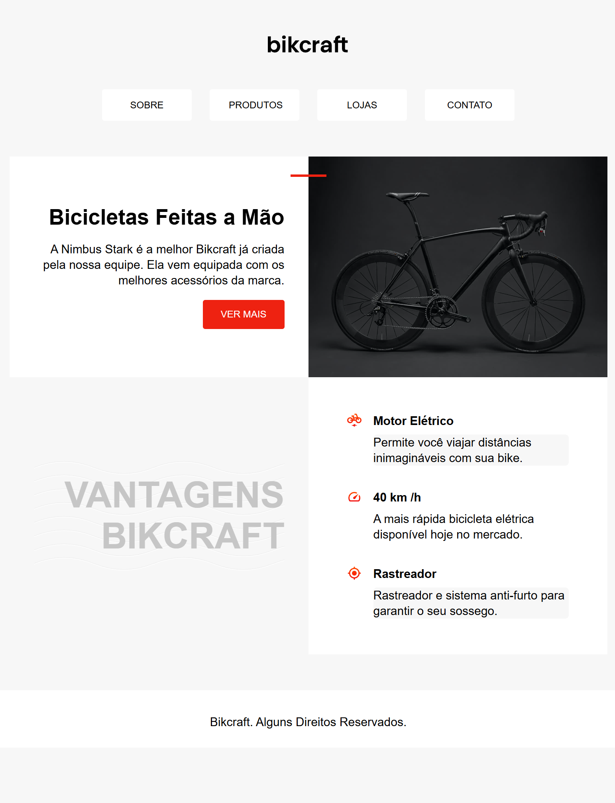

# Bikcraft 🎓🚀
### Further studies in CSS 📚

By that point I realized CSS is bigger than I may have thought. I've got back to studying pure CSS through one of the courses of [**Origamid**](https://www.origamid.com/).

## Dates 👨‍💻🗓️
### 🗝️ First commit
- Apr 16, 2024
### 🔐 Last commit
- Apr 20, 2024

## 🛠️ Stack
[HTML](https://html.spec.whatwg.org/multipage/) – Markup language

[CSS 3](https://www.python.org) – Style sheet language

## 📷 Screenshot

## 🎓 Credits
Developed by [**Daniel Crema**](https://github.com/DanielCrema) as a study case for educational purposes.

***Special thanks*** to:
#### 🕋🤲 **Almighty God** (ﷻ), for having given me intelligence and persistence to learn.